# Website ecommerce Helendo selling furniture

# Mô tả website

-   Bảng thiết kế các lớp:
    [Link bảng thiết kế class](https://drive.google.com/file/d/11JSxrB7UKw69p-p2fQTfUwzM5ABYs5nx/view?usp=share_link)
    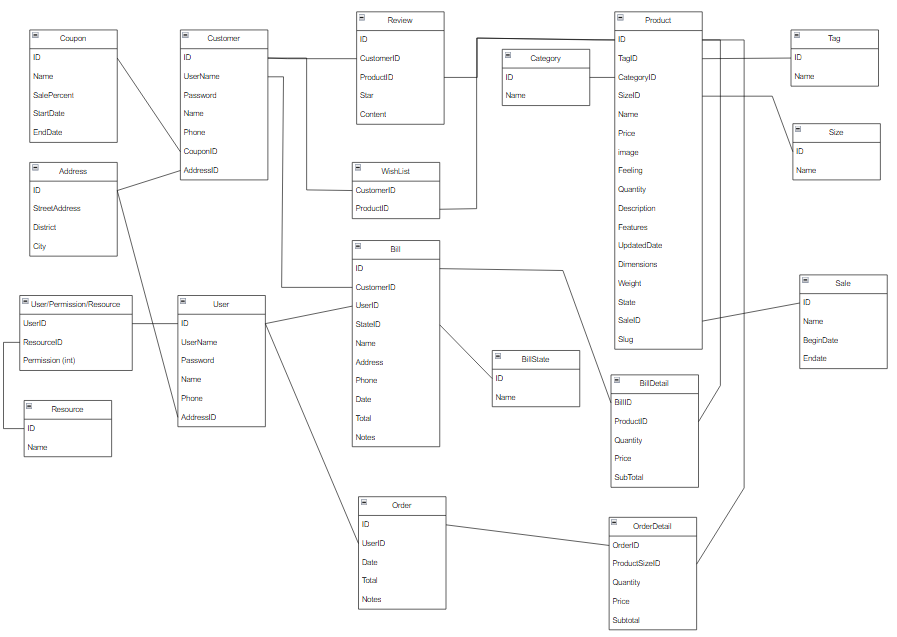

-   Các chức năng hiện có:

1. Hiển thị thông tin sản phẩm và tìm kiếm sản phẩm
2. Xem giỏ hàng
3. Tạo hóa đơn

-   Một số hình ảnh:

1. Home
   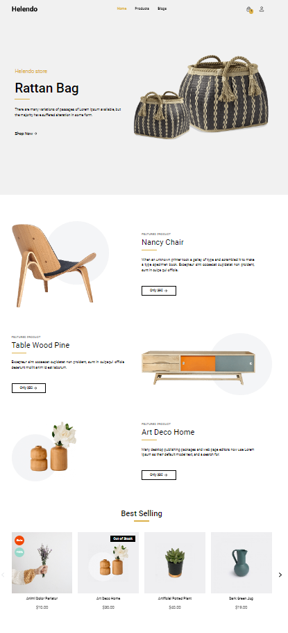
2. Product
   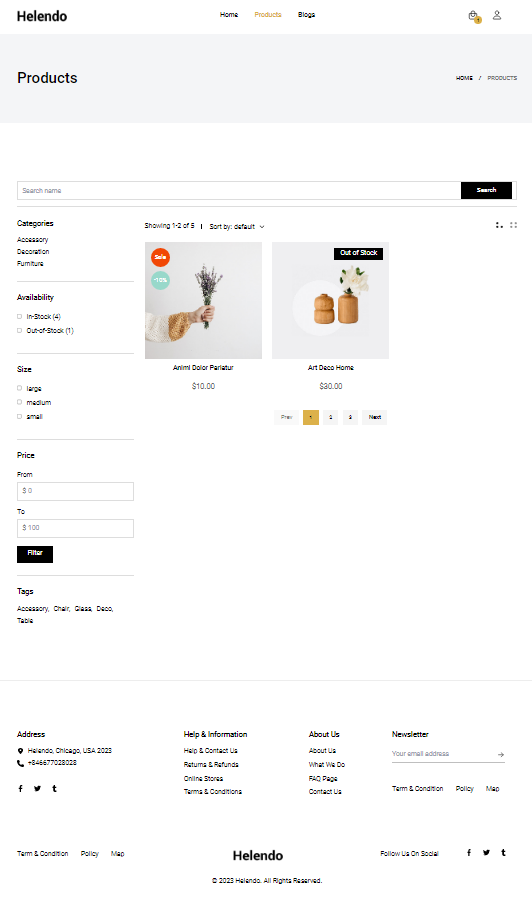
3. Cart
   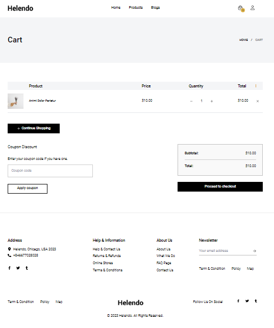
4. Checkout
   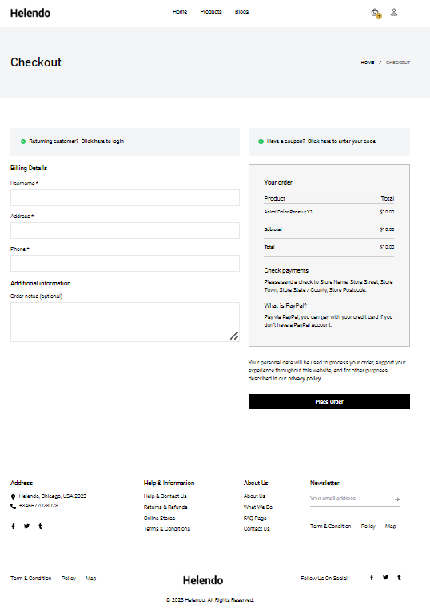
5. Login user
   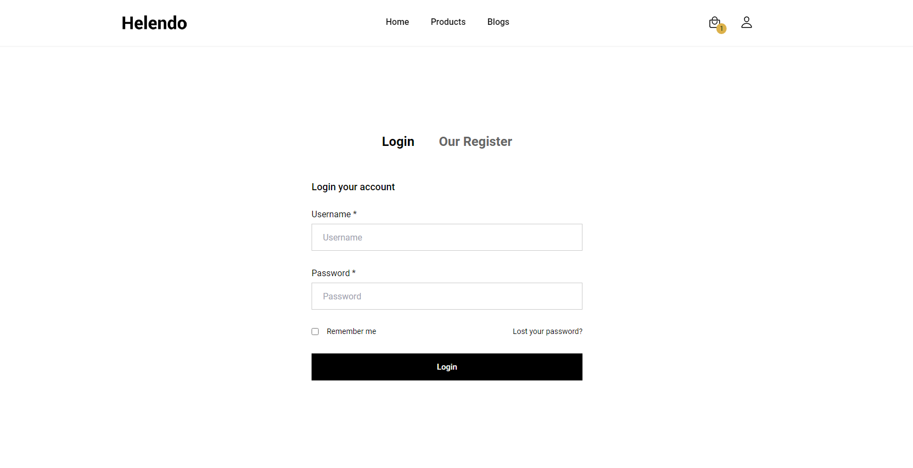
6. Register user
   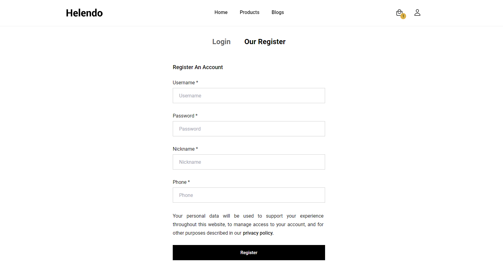
7. User
   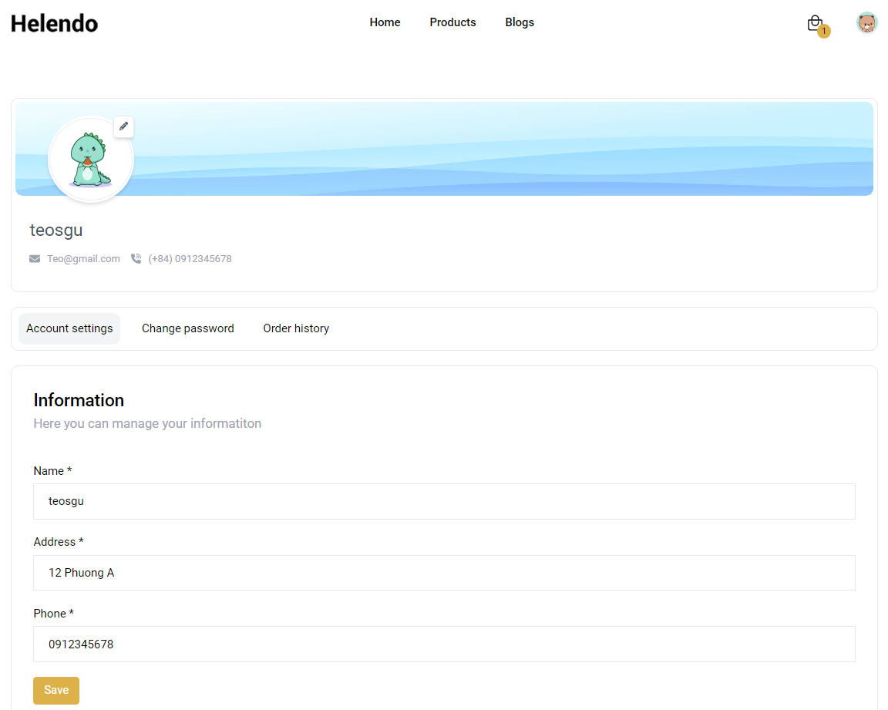
8. Login manage
   
9. Manage bill
   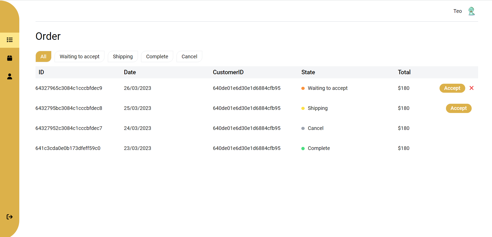
10. Manage product
    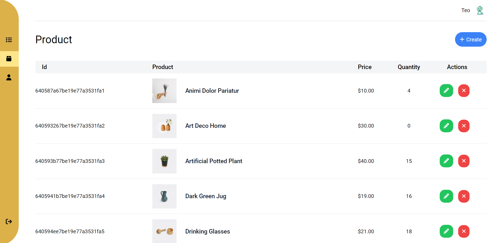
11. Manage customer
    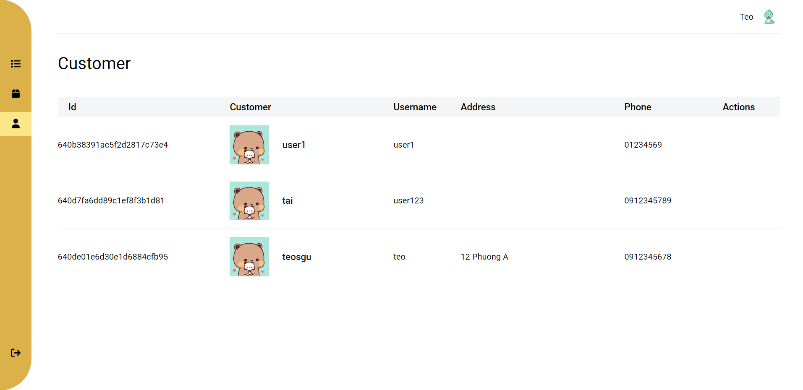
12. Statistic
    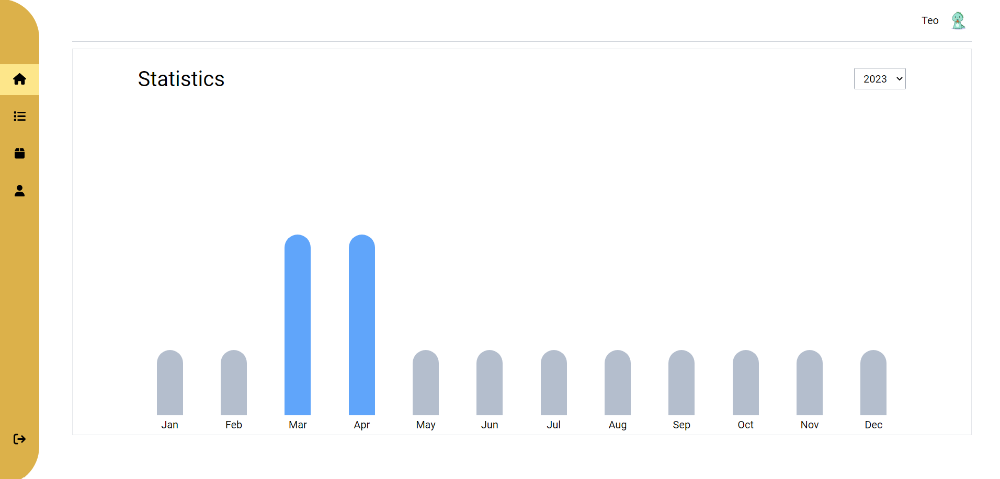
